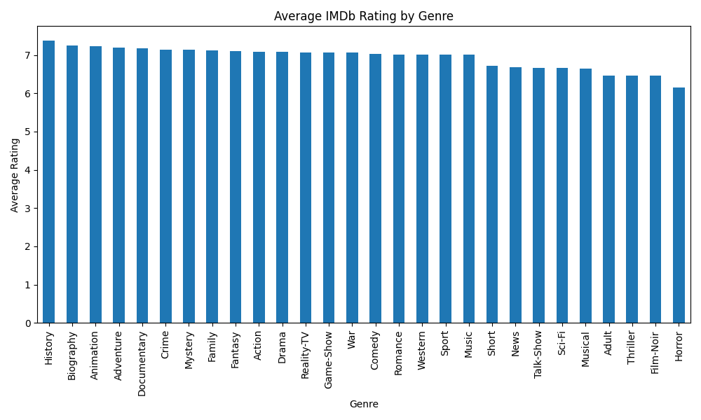
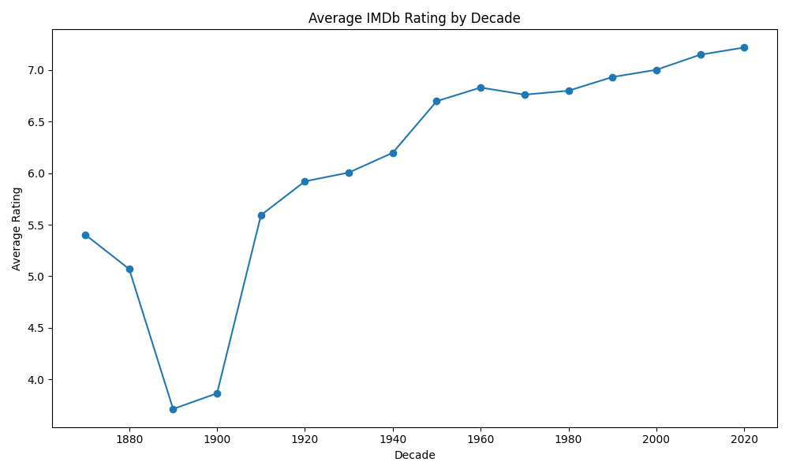
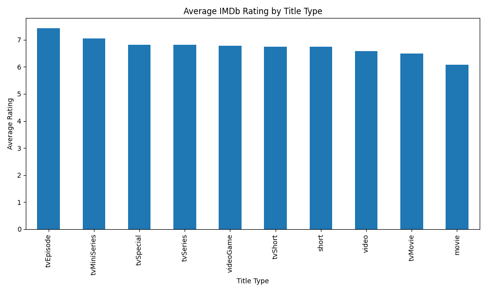

# IMDb Ratings Analysis

An exploration of what factors, genre, title type, and release decade correlate with higher average ratings on IMDb.

## Question

What patterns exist in IMDb ratings across genres, title types (movies vs. TV series vs. episodes, etc.), and decades of release?

## Data Source

IMDb's official non-commercial datasets: https://datasets.imdbws.com/
- `title.basics.tsv` — title, genre, runtime, release year, type
- `title.ratings.tsv` — average rating and vote count

## Method

- Merged the two datasets on `tconst` (IMDb's unique title ID)
- Cleaned missing values, removed duplicate rows
- Filtered unrealistic runtime values for movies (>240 minutes)
- Flagged TV series runtime as unreliable above 500 minutes, since IMDb data doesn't consistently distinguish per-episode vs. total-series runtime
- Filtered startYear/endYear to plausible ranges (1880–2026), while correctly keeping titles (like movies) that don't have an endYear at all
- Split and exploded the multi-value `genres` column so each title counts toward every genre it belongs to
- Tools: Python, pandas, matplotlib

## Findings

**By genre:** History and Biography titles have the highest average ratings; Horror has the lowest.

**By decade:** Average ratings fluctuate over time rather than following a steady trend, with the lowest point around 1885 and the highest around 2020. Ratings stayed fairly consistent through 1980–2000 before diverging again.

**By title type:** TV episodes rate highest on average, movies rate lowest — likely because episode viewers are usually already fans of a show, while movie audiences are broader and more critical.

## Charts

## How to Run

1. Download `title.basics.tsv` and `title.ratings.tsv` from the link above
2. `pip install pandas numpy matplotlib`
3. Run `python analysis.py`