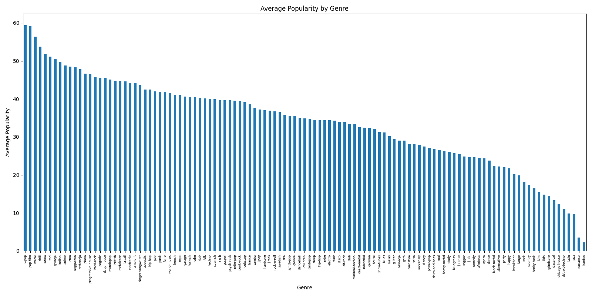

# Spotify Tracks Analysis

An exploration of what factors — genre and popularity — relate to a track's audio characteristics on Spotify.

## Question

What patterns exist between genre, popularity, and audio features (danceability, energy, valence, tempo) across Spotify tracks?

## Data Source

Spotify Tracks Dataset (Kaggle): [link to the exact dataset page you used]
- ~114,000 tracks across 114 genres
- Includes audio features (danceability, energy, valence, tempo, loudness, etc.) alongside popularity and genre

## Method

- Cleaned missing values in artist/album/track name fields
- Removed rows with tempo = 0 (undetected tempo, ~157 tracks, spread across genres)
- Confirmed no duplicate tracks (checked both full-row duplicates and `track_id` specifically)
- Investigated duration outliers (very short classical pieces, very long afrobeat/remix tracks) and confirmed these were legitimate, not data errors
- Recognized that some numeric-looking columns (`key`, `mode`, `time_signature`) are actually categorical, not continuous — encoded music-theory labels rather than quantities to average
- Loaded the cleaned dataset into a SQLite database and queried it with SQL for aggregation (average popularity by genre)
- Tools: Python, pandas, SQL (SQLite), matplotlib

## Findings

**By genre:** [your interpretation — which genres had highest/lowest average popularity? k-pop and pop-film were near the top, iranian and romance near the bottom]

## Charts

## How to Run

1. Download `dataset.csv` from the Kaggle link above
2. `pip install pandas numpy matplotlib`
3. Run `python analysis.py`